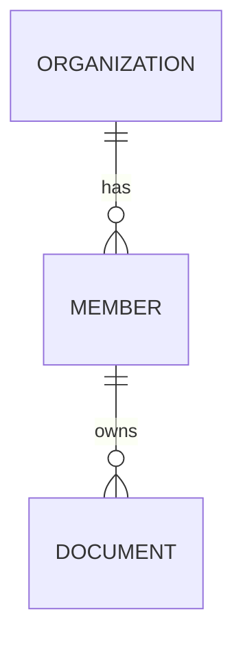

# Logical data model
Why required / why omitted:
Entities, IDs, ownership, tenancy and relationships:
Lifecycle, constraints, retention, security and mock/live indicators:
ERD (when persistent or relational data):

API/data contract references:
