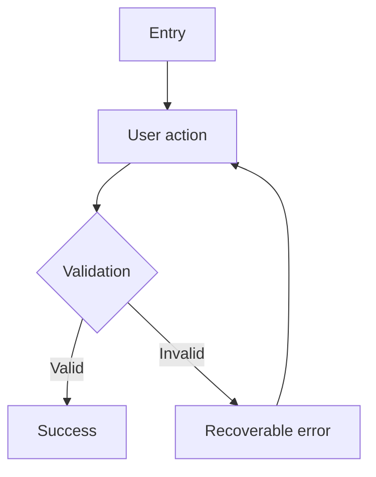

# Functional flow
Start/end state, actors and role limits:

```mermaid
flowchart TD
 A[Entry] --> B[User action]
 B --> C{Validation}
 C -->|Valid| D[Success]
 C -->|Invalid| E[Recoverable error]
 E --> B
```
Loading/empty/error/retry and cross-device variants:
Acceptance test IDs:
